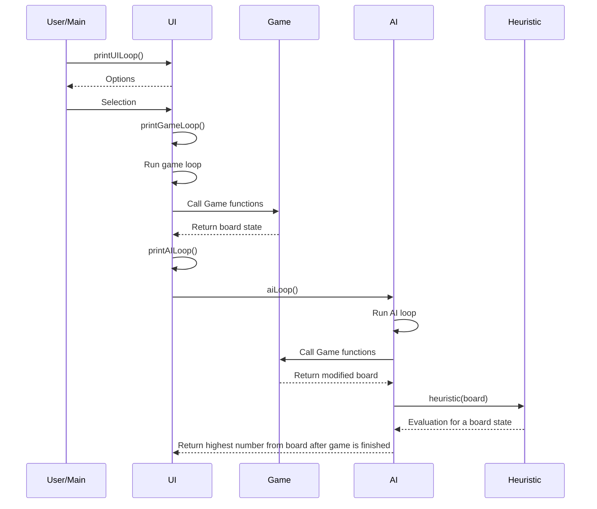

# Toteutusdokumentti

## Ohjelman rakenne

Ohjelma on jaettu neljään pääluokkaan: UI, Game, AI ja Heuristic. UI luokka hallinoi käyttöliitymää, 2048 pelin funktiosta vastaa luokka Game, tekoälyn pelaamisesta ja siihen tarvittavista funktiosta vastaa AI luokka. Heuristic luokkaa käytetään tekoälyn expectiminimaxin toimesta pelilaudan tilan hyvyyden arvioimiseen.

Alla oleva sekvenssikaavio kuvaa näiden luokkien välistä liikennettä:

## Saavutetut aika- ja tilavaativuudet

Expectiminimax algoritmin pahimmman tapauksen aikavaativuus on $O(b^m n^m)$ missä b on haarautumiskerroin (Mahdollisten liikkeiden määrä per solmu), n on mahdollisten satunaisten tapahtumien määrä (Tyhjien ruutujen määrä) ja m on haun syvyys (Eli kuinka monen liikkeen päähän algoritmi katsoo jokaisessa tilanteessa).

Tässä projektissa toteutettu expectiminimax käy jokaisen siirron kohdalla kaikki mahdolliset liikkeet (Ylös, alas, vasen ja oikea) ja kaikki mahdolliset satunaiset tapahtumat jokaisen liikkeen jälkeen (Mahdollinen 2 tai 4 ilmestyminen jokaiseen vapaaseen ruutuun) käyttäjän antamalla syvyydellä. Täten myös tässä toteutuksessa pahimman mahdollisen tilanteen aikavaativuus on $O(b^m n^m)$ 

Tekoälyn pelatessa peliä pelilauta kopioidaan aina jokaisen testattavan liikkeen yhteydessä mutta taulukoiden koko pysyy vakiona joten kokonaisuudessaan tilavaativuus pysyy vakiona.

## Puutteet ja parannusehdotukset

Pelin toimintafunktiot eivät ole tällä hetkellä kovin tehokkaita. Tämä johtaa siihen että tekoälyn käyttämän expectiminimaxin hakusyvyyttä ei voi kasvattaa juuri kahta suuremmaksi koska siirtojen tekemiseen kuluma aika kasvaa turhan pitkäksi.  

## Laajojen kielimallien käyttö.

Tässä projektissa ei ole käytetty apuna mitään kielimalleja tai tekoälytyökaluja.

## Lähteet

https://en.wikipedia.org/wiki/Expectiminimax \
Yun Nie, Wenqi Hou, Yicheng An, AI Plays 2048 (https://cs229.stanford.edu/proj2016/report/NieHouAn-AIPlays2048-report.pdf)